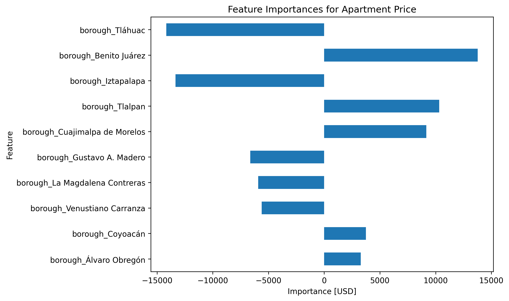

# Mexico City Housing Price Prediction 🏠

This project predicts housing prices in Mexico City using a **Ridge Regression model**.
It demonstrates an **end-to-end data science workflow** including data cleaning, feature engineering, model building, and interpretation.

---

## 📌 Objectives
- Build a regression model to predict apartment prices in Mexico City.
- Create a data pipeline for imputing missing values and encoding categorical variables.
- Compare model performance against a baseline.
- Identify the most important features driving housing prices.
- Communicate results through visualizations.

---

## 📊 Dataset
- Data includes apartment listings with attributes such as surface area, location, and price.

---

## 🛠️ Tools & Libraries
- Python (pandas, numpy, matplotlib, seaborn)
- scikit-learn (Linear Regression, Ridge, pipelines)
- category_encoders (OneHotEncoder)
- ipywidgets (for interactivity)
- matplotlib / seaborn (for visualization)

---

## 🚀 Workflow
1. **Wrangle Data**  
   - Filtered apartments in Distrito Federal with price < 100,000 USD  
   - Removed outliers (bottom & top 10% of surface area)  
   - Extracted latitude, longitude, and borough features  

2. **Exploratory Data Analysis (EDA)**  
   - Distribution plots of price  
   - Identified key features correlated with price  

3. **Modeling**  
   - Baseline: Mean predictor (baseline MAE)  
   - Ridge regression pipeline (encoding, imputation, regularization)  

4. **Evaluation**  
   - Compared baseline MAE vs Ridge MAE  
   - Extracted and visualized top feature importances  

---

## 📈 Results
- **Baseline MAE**:  17239.93
- **Ridge Model MAE**: 14943.16 
- **Top Features**: Borough, latitude/longitude  

---

## 📂 Repository Structure
housing-price-mexico/
├── data/              # Raw and processed datasets (if public)
├── housing_app/       # Python code 
├── venv/              # Virtual environment (not needed in repo)
├── images/            # Plots and visualizations
└── README.md          # Project overview